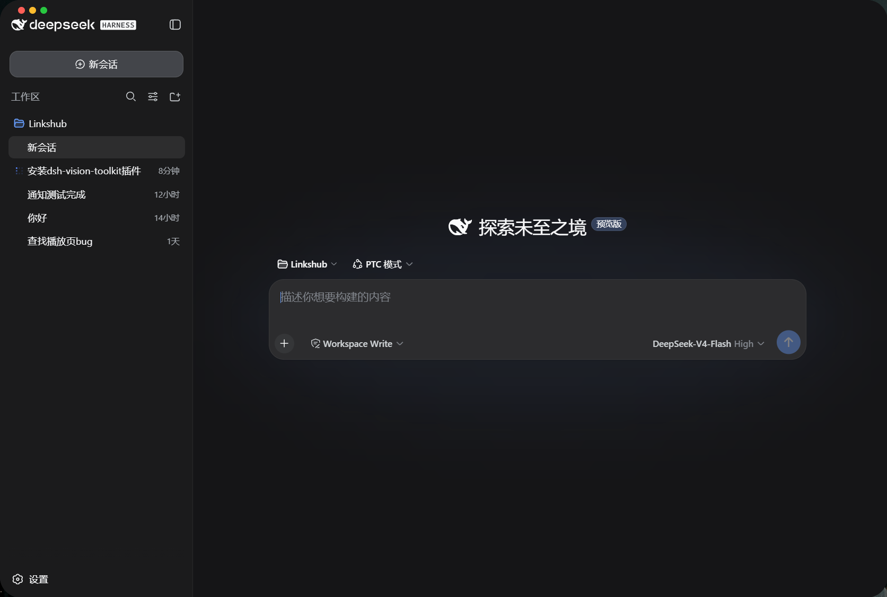
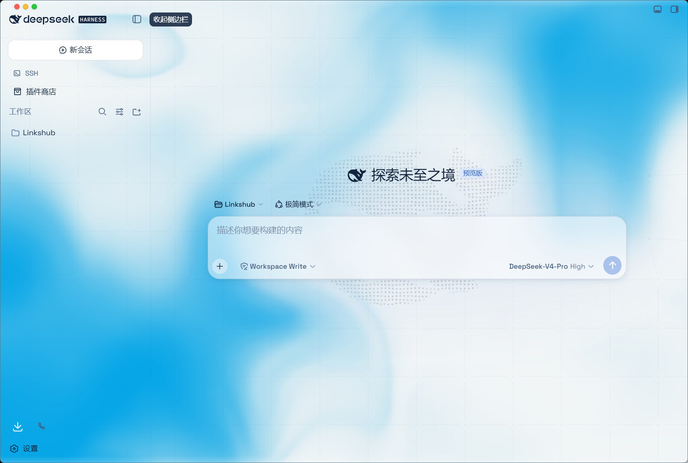
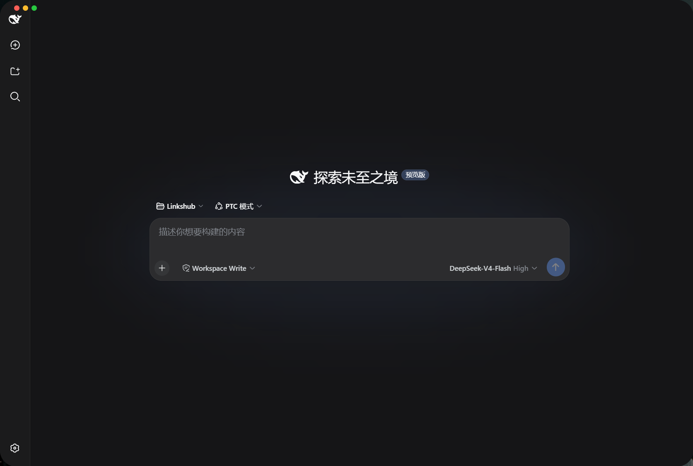

<p align="center">
  
</p>

<h1 align="center">DeepSeek Harness Desktop</h1>

<p align="center">
  轻量、快速、完整离线的 DeepSeek Harness Windows 桌面发行版。
</p>

<p align="center">
  <a href="https://github.com/Links2008/DeepSeek-Harness-Desktop/releases/latest"></a>
  <a href="https://github.com/Links2008/DeepSeek-Harness-Desktop/releases"></a>
  
  <a href="LICENSE"></a>
</p>

<p align="center">
  <a href="https://github.com/Links2008/DeepSeek-Harness-Desktop/releases/latest"><strong>下载 v4</strong></a>
  · <a href="#v4-重大升级">重大升级</a>
  · <a href="#为什么选择桌面版">软件优点</a>
  · <a href="#从源码构建">源码构建</a>
  · <a href="https://github.com/Links2008/DeepSeek-Harness-Desktop/issues">问题反馈</a>
</p>

> [!IMPORTANT]
> **v4.0.0 是重大升级。** 后端运行时由“Electron + 独立 Node”改为 Electron 直接承载 Node，安装包显著轻量化；v3 的配置、会话、凭据和插件目录继续保留。

## 产品预览

<p align="center">
  
</p>

<table>
  <tr>
    <td width="50%"></td>
    <td width="50%"></td>
  </tr>
  <tr>
    <td align="center">Agent 预设与模式切换</td>
    <td align="center">紧凑侧栏与沉浸工作区</td>
  </tr>
</table>

## v4 重大升级

### 1. 安装包轻量化

- 移除重复打包的独立 `node.exe`，直接用 Electron 43 内置的 Node 24 启动 Harness。
- Chromium 只保留简体中文、繁体中文和英文语言包。
- runtime 不再携带 PDB、ARM64 预构建、测试夹具、TypeScript 类型源码和包内示例文档。
- 保留完整离线安装：Harness runtime、原生终端、图片处理和插件能力仍随安装包提供。
- v4.0.0 安装包为 **166,768,057 字节（159.04 MiB）**，较 v3 基线减少 **55.36 MiB / 25.82%**；Release 同时公布 SHA-256 供复核。

### 2. 冷启动和首屏响应

- compile cache 改由正式 Electron Node 生成，构建态与运行态 ABI、Node 版本完全一致。
- 启动依赖预打包并按 profile 指纹复用，依赖未变化时跳过重复编译。
- 3080 端口开放后立即预加载主界面，插件树 settle 后再释放启动遮罩。
- 非关键桌面注入后置，不再阻塞编辑器首屏；启动阶段仍保留可诊断时序。

### 3. 浅色 UI 与兼容模式

- 启动页、窗口背景和系统标题区域跟随 Windows 深浅色偏好。
- 设置页兼容 Aqua 主题注册形式，避免主题插件升级后的设置入口失配。
- 侧栏和窗口控件动效使用可中断的合成动画；系统“减少动态效果”开启时自动降级。
- 兼容模式保留必要的菜单、对话框和窗口控件动效，不强行启用高成本背景效果。

### 4. 插件与数据安全

- 保留 `~/.dsh` 中已有的 DSH-IM、Aqua、会话、模型配置和凭据；升级不会重置 profile。
- 单个第三方插件缺失构建产物时可隔离故障项，避免拖垮整个后端。
- DSH-IM 等社区插件仍由用户 profile 管理，桌面安装包不把个人插件和配置写入公共制品。

完整升级说明见 [v4.0.0 Release Notes](release-notes-v4.0.0.md)。

## 为什么选择桌面版

| 优点 | 带来的体验 |
| --- | --- |
| 轻量离线安装 | 一次下载即可使用，不在首启临时下载运行时 |
| 原生 Windows 壳 | 单实例、系统通知、无边框窗口、快捷方式和完整卸载 |
| 更快启动 | compile cache、依赖预打包和主界面预加载共同缩短等待 |
| 插件兼容 | 保留现有 profile，支持 DSH-IM、Aqua 与 Harness 插件生态 |
| 更新可靠 | 下载、校验、退出进程树、静默覆盖安装和快捷方式恢复形成闭环 |
| 隐私明确 | 公共仓库和安装包不包含 API Key、Cookie、凭据、会话或本机日志 |

## 一分钟开始

1. 打开 [Latest Release](https://github.com/Links2008/DeepSeek-Harness-Desktop/releases/latest)。
2. 下载 `DeepSeekHarness-Setup-4.0.0.exe`。
3. 运行安装向导并选择安装目录。
4. 从桌面快捷方式或开始菜单启动 **DeepSeek Harness**。

> [!NOTE]
> 安装包暂未使用商业代码签名证书，SmartScreen 可能显示“未知发布者”。请在 Release 页面核对安装包字节数和 SHA-256。

## 自动更新

用户点击侧栏更新按钮后，桌面端从本仓库 Releases 检查并下载完整安装包。更新前会终止后端进程树，安装完成后补齐缺失的桌面和开始菜单快捷方式。

GitHub Actions 仅以只读权限执行测试、归档、SHA-512、隔离安装、AppID、Harness 版本、HTTP 200、原生模块、端口释放和卸载验收，不提交代码或发布 Release。通过后由 `Links2008` 身份人工核对制品并发布为 Latest。

## 上游与版本谱系

本仓库是独立的 Windows 桌面发行仓库，核心能力来自官方 [deepseek-ai/deepseek-harness](https://github.com/deepseek-ai/deepseek-harness)。

| 项目 | 当前值 |
| --- | --- |
| 桌面版本 | `4.0.0` |
| Harness 版本 | 见 [`upstream-lock.json`](upstream-lock.json) |
| 上游分支 | `master` |
| 锁定提交 | 见 [`upstream-lock.json`](upstream-lock.json) |
| 状态文件 | [`upstream-lock.json`](upstream-lock.json) |

## 从源码构建

```powershell
npm ci
npm test
npm run build:installer
```

本地完整构建需要先在 `bundle/dsh-runtime` 组装官方 Harness runtime。Electron 依赖同时提供桌面壳和后端 Node 运行时，不再需要 `bundle/node/node.exe`。只读自动验收流程见 [upstream-sync.yml](.github/workflows/upstream-sync.yml)。

## 安全与隐私

- 不打包 API Key、Token、Cookie、`.credentials.yaml`、`~/.dsh`、用户会话或日志。
- 后端只监听本机 `127.0.0.1:3080`。
- Release 发布前验证安装、启动、原生模块、清理和卸载。
- 请勿在公开 Issue 中粘贴凭据或完整用户日志。

## 贡献与许可证

欢迎通过 [Issues](https://github.com/Links2008/DeepSeek-Harness-Desktop/issues) 反馈 Windows 安装、启动、界面、插件兼容或更新问题。提交代码前请运行 `npm test`。

桌面壳、构建脚本和配置遵循 [MIT License](LICENSE)；DeepSeek Harness 与第三方依赖继续遵循各自许可证。
